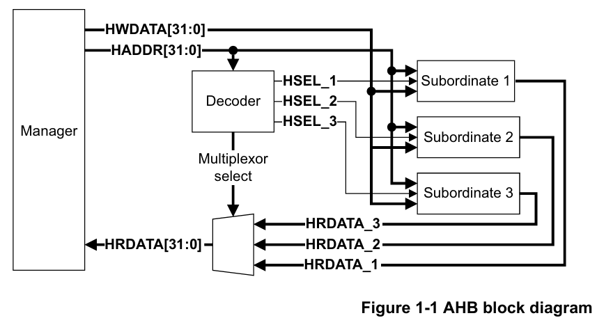

# AHB (Advanced High-performance Bus)

O AHB é um barramento de alta performance também parte da arquitetura AMBA, mas geralmente utilizado para componentes que requerem uma comunicação rápida, mas menos complexa que o AXI. Ele é frequentemente usado para conectar o processador central, memória e periféricos de alta largura de banda.

## Principais Características do AHB

1. **Alta Largura de Banda**: Otimizado para transferências de dados em alta velocidade.
2. **Barramento de largura fixa**: normalmente 32 ou 64 bits.
3. **Operação em Borda Única do Clock**: Simplifica o tempo e a integração dos componentes.
4. **Operação Pipelined**: Suporta pipeline para maior rendimento.
5. **Múltiplos Mestres no Barramento**: Permite que vários mestres (ex.: CPUs, controladores DMA) compartilhem o barramento.
6. **Transações Divididas (Split Transactions)**: Permite que mestres utilizem o barramento enquanto aguardam dados de periféricos mais lentos.
7. **Transferências em Burst**: Suporta a transferência de múltiplos itens de dados em uma única transação, melhorando a eficiência.
8. **Árbitro central**: há um controlador que define qual mestre tem acesso ao barramento.

## Componentes da Arquitetura AHB

### 1. **Mestre**

- Dispositivo capaz de iniciar operações de leitura ou escrita.
- Exemplos: CPU, controladores DMA.

### 2. **Escravo**

- Dispositivo que responde às operações iniciadas por um mestre.
- Exemplos: Memória, periféricos.

### 3. **Arbitrador**

- Gerencia o acesso ao barramento compartilhado quando múltiplos mestres o requisitam simultaneamente.
- Garante alocação justa e priorizada.

### 4. **Decodificador**

- Mapeia os endereços para os dispositivos escravos apropriados.
- Assegura que as solicitações do mestre sejam direcionadas ao destino correto.

---

# Multi-layer AHB

O **Multi-layer AHB** é um esquema de interconexão baseado no protocolo AHB que permite caminhos de acesso paralelos entre múltiplos mestres (masters) e escravos (slaves) em um sistema. Isso é alcançado através de uma matriz de interconexão mais complexa.

## Vantagens Principais

- **Maior largura de banda disponível**: Permite desenvolver sistemas multi-mestre com maior capacidade de comunicação simultânea no barramento.
- **Arquitetura flexível**: Facilita a construção de sistemas complexos sem a necessidade de decisões fixas sobre alocação de recursos no estágio de projeto de hardware.
- **Compatibilidade**: Permite o uso de módulos mestre e escravo padrão do AHB sem necessidade de modificações.
- **Camadas simplificadas**: Cada camada do AHB pode ser simples, já que possui apenas um mestre. Isso elimina a necessidade de arbitragem ou multiplexação mestre-para-escravo, permitindo o uso do protocolo AHB-Lite.
- **Arbitragem localizada**: A arbitragem ocorre diretamente em cada periférico e é necessária apenas quando mais de um mestre tenta acessar o mesmo escravo simultaneamente.
- **Infraestrutura mínima adicional**: O único hardware extra necessário é o bloco de multiplexação para conectar múltiplos mestres aos periféricos.
- **Reutilização de componentes**: Por ser baseado no protocolo AHB existente, mestres e escravos previamente projetados podem ser reutilizados sem modificações.

---

# Referencias

- https://developer.arm.com/documentation/ihi0033/latest/
- https://developer.arm.com/documentation/dvi0045/latest/
- https://docs.nordicsemi.com/bundle/ps_nrf52840/page/ahbmultilayer.html
- https://civilpedia.org/p/?t=STM32-DMA-Cheat-Sheet&pid=315
