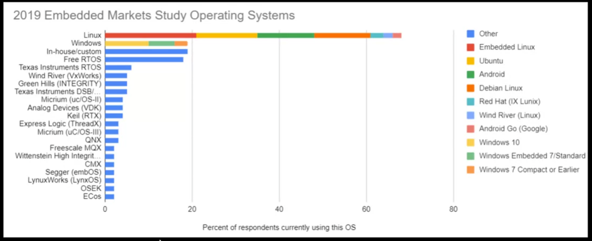

# Linux Processes

- ELF (Executable and linkable Format) rodando no hardware
- Os recursos necessários para a execução são atribuídos e geridos pelo kernel através de chamadas de sistema:
  - Timers
  - Files
  - Hardware access
- Um processo possui identificadores próprios (PID - Process ID)
- Executados em processadores virtualizados e visão virtualizada da memória:
  - Para o software é como se ele tivesse CPU/RAM dedicados

# Linux Processes

- Unidade de atividade de um processo
- Um Processes pode ser single-threaded ou multithreaded
- Compartilhamento de memória: As threads de um mesmo processo compartilham o mesmo espaço de memória e recursos. Isso facilita a troca de dados entre threads, mas aumenta o risco de condições de corrida. Cada Thread possui:
  - Stack - armazena variaveis locais
  - Processor state/current location
- Execução paralela: Em um sistema com múltiplos núcleos, threads podem ser executadas em paralelo, permitindo que o programa faça mais de uma tarefa ao mesmo tempo.
- Espaco de endereco de memória é compartilhados entre threads

# Linux Processes/Threads and Memory

- Cada Process possui sua propria memoria virtualizada
- Cada Thread compartilha a memoria virtual do processo
- Compartilhamento de memoria entre Threads:
  - Acesso direto (uso de sincronizacao)
- Compartilhamento de memoria entre Process:
  - Uso de Inter-Process Communication (IPC)

# Linux de Inter-Process Communication (IPC)

- Permite a troca ed informacoes entre processos sem utilizar variaveis globais
  - Pipes
  - Semaphores
  - Message Queues
  - Shared Memory