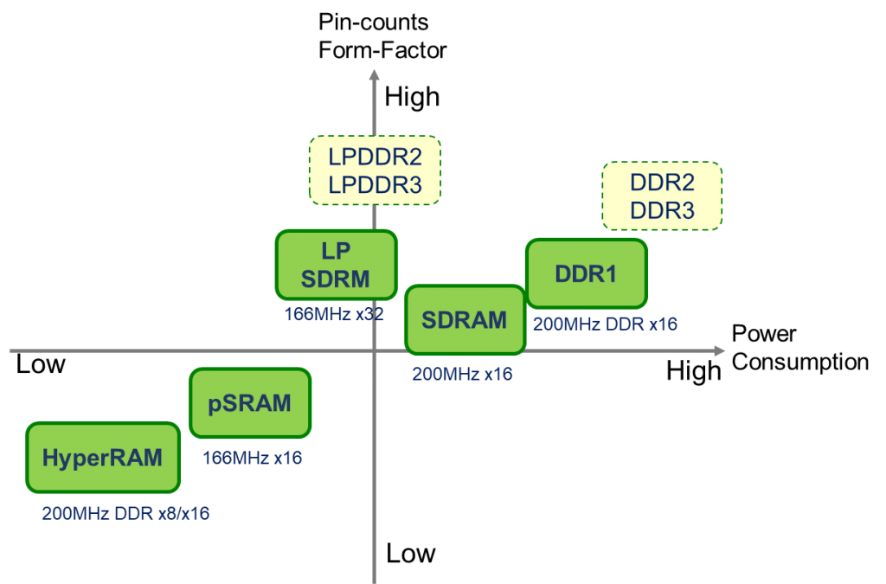
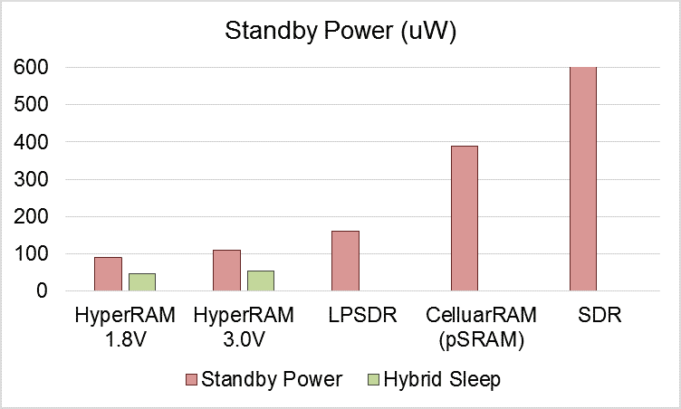
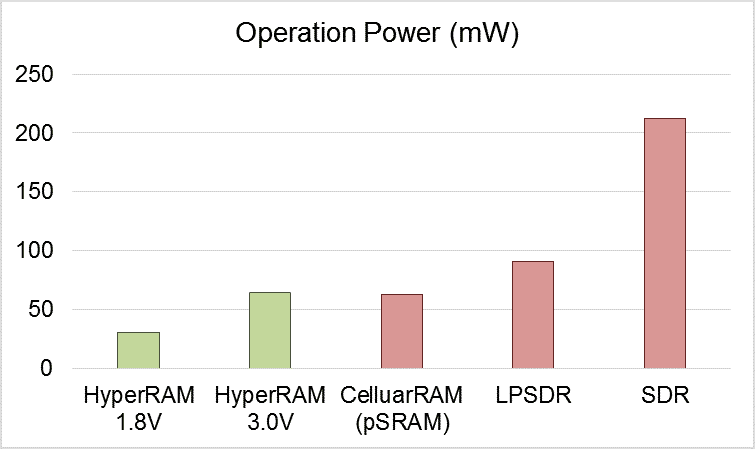
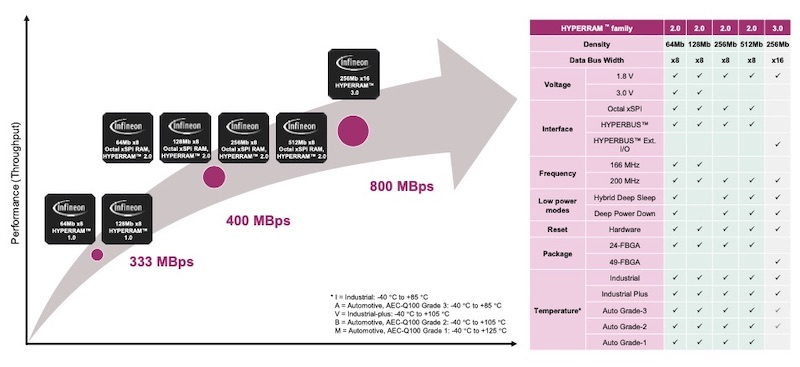

# Memória HyperRAM

HyperRAM é um tipo de memória DRAM que oferece um desempenho semelhante ao DRAM convencional, mas com um consumo de energia significativamente menor, o que a torna adequada para dispositivos embarcados e aplicações de baixo consumo de energia. Ela é particularmente útil em aplicações onde a densidade de memória é importante, mas o consumo de energia precisa ser mantido baixo, como dispositivos IoT e portáteis.

- Pode ser encontrado HyperRAM com interface [HyperBus](../CommProtocol/HyperBus.md), [xSPI](../CommProtocol/SPI.md##xSPI) e [octaSPI](../CommProtocol/SPI.md##OctaSPI)

### Benefícios do HyperRAM

- **Baixa Contagem de Pinos**: Reduz o número de pinos necessários, simplificando o design do PCB.
- **Baixo Consumo de Energia**: Ideal para dispositivos operados por bateria e aplicações com eficiência energética.
- **Facilidade de Controle**: Simplifica a lógica de controle, facilitando a integração em vários sistemas.

### Comparação com Outras Memórias

Comparado com outras DRAMs, o HyperRAM opera com a mesma largura de banda, mas com menos pinos e menor consumo de energia. Além disso, ele introduz a nova interface HyperBus, oferecendo mais opções para a expansão de memória.

## Fabricantes

Vários fabricantes produzem memórias HyperRAM, incluindo:
- **Cypress**
- **ISSI**
- **Winbond**

## Referência

Para mais informações detalhadas, você pode visitar o [artigo sobre HyperRAM da Winbond](https://www.winbond.com/hq/support/online-learning/articles-item/what-you-need-to-know-about-hyperram.html?__locale=en).
