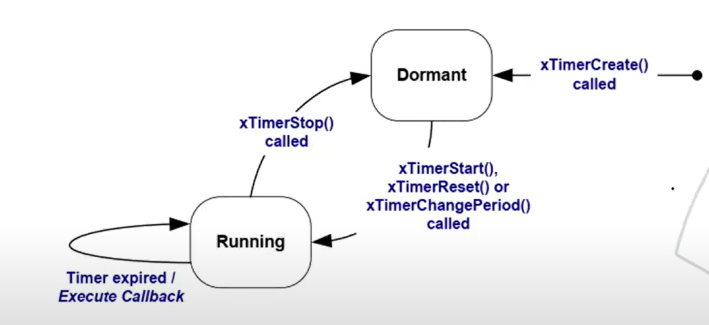
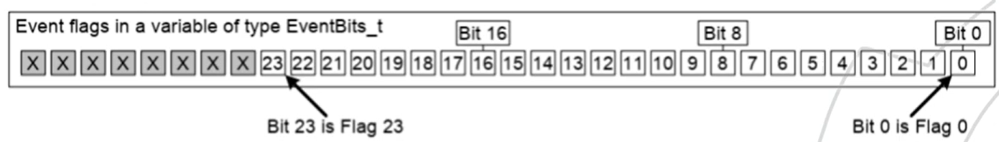

# FreeRTOS

## Introdução

Criado por Richard Barry em 2000.
Atualmente é mantido pela Amazon.

## FreeRTOS Portable File Strucuture

- FreeRTOS
  - Source
    - Include (Directory containing all headers to API functions)
    - Portable (Directory containing all port specific source file)
      - MemMang (Directory containing the 5 alternative heap allocation source files)
      - taks.c
      - queue.c
      - list.c
      - timers.c
      - GCC (Directory containing files for gcc compiles)
        - Files to GCC Compiler
      - IAR
        - Files to IAR Compiler

### Principais arquivos

* task.c: Fornece o básico para manipulação de task
* list.c: Implementa a função de lista para armazenar outros recursos
* queue.c: Prove os serviços de sempahore e queue
* timers.c: Fornece a funcinalidade de software timers
* event_groups.c : Fornece funcionalidade de grupo de event_groups
* croutine.c : Implementa funcionalidade de corotina. Não é mais muito utilizada, apesar de gastar menos memória (usado em embarcados que tem pouca memoria) a maioria dos microcontroladores atuais possuem a memória necessária para não precisar usar esse recurso. Desvantagem é que existe um unico bloco de memória para varias tarefas, ou seja, é mais fácil ter problemas relacionados a memória.

Os arquivos abaixo são os arquivos normalmente escritos em assembly e são escritos para cada compilador. Pois cada compilador interage com o C + Assembly de maneira diferente. De maneira geral, o port e portMacro são escritos e fornecidos pela fabricante.

* port.c
* portMacro.h

A configuração geral, como as funcionalidades que serão utilizada na aplicação devem ser configuradas no arquivo:

* FreeRTOSConfig.h

## Licensing

Anteriormente era GPL, visto como um pouco problemático.
Atualmente a licença é MIT, que é mais permissiva.

## Memory

O FreeRTOS pega parte da Heap do sistema e para cada task ele cria  região de stack e heap.

* **Stack:** A stack é uma área de memória usada para o armazenamento temporário de dados que têm um ciclo de vida curto e seguem uma estrutura LIFO (Last In, First Out). A stack é gerenciada automaticamente pelo sistema. O que é armazenado: Endereço de retorno de função, variavel local, variaveis temporarias, contexto de CPU
* **Heap:** A heap é uma área de memória usada para alocação dinâmica, onde o programador tem mais controle sobre a alocação e liberação de memória. A heap é gerenciada manualmente pelo programador (ou pelo sistema de gerenciamento de memória do RTOS).

| **Aspecto**       | **Stack**                             | **Heap**                                       |
| ----------------------- | ------------------------------------------- | ---------------------------------------------------- |
| **Gerenciamento** | Automático (gerenciado pelo sistema)       | Manual (gerenciado pelo programador)                 |
| **Ciclo de Vida** | Curto (variáveis locais)                   | Longo (dados persistentes até liberação)          |
| **Tamanho**       | Definido em tempo de compilação (fixo)    | Dinâmico (limitado pela memória total disponível) |
| **Velocidade**    | Rápida para alocar e liberar               | Mais lenta, pois envolve busca por blocos livres     |
| **Problemas**     | Overflow se a pilha crescer além do limite | Fragmentação e vazamento de memória               |

No FreeRTOS, as funções pvPortMalloc() e vPortFree() são as versões personalizadas de alocação e liberação de memória dinâmica que substituem as funções padrão do C (malloc() e free()). Elas são utilizadas para garantir que o sistema operacional de tempo real tenha controle sobre a alocação de memória e possa trabalhar de forma eficiente em sistemas embarcados, que geralmente possuem recursos limitados.

**Considerações sobre o uso de pvPortMalloc() e vPortFree():**

* **Fragmentação:** O uso de alocação dinâmica pode causar fragmentação de memória, especialmente quando a heap é usada para alocar e liberar blocos de diferentes tamanhos repetidamente. Heap_4 e heap_5 têm funcionalidades para minimizar esse problema.
* **Overflow da Heap:** Se o FreeRTOS esgotar a heap (não houver mais memória disponível), pvPortMalloc() retornará NULL. Portanto, é sempre importante verificar se o ponteiro retornado não é NULL antes de usar a memória alocada.
* **Configuração do tamanho da heap:** O tamanho da heap usada pelas funções de alocação dinâmicas é configurado na macro configTOTAL_HEAP_SIZE no arquivo de configuração FreeRTOSConfig.h. Este valor define o total de memória disponível para alocações dinâmicas.

**O FreeRTOS oferece cinco implementações de gerenciamento de heap (heap_1 a heap_5)**

* **heap_1**: Implementa uma alocação de memória muito simples. Ocorre sem liberação de memória, ou seja, uma vez alocada, a memória não pode ser liberada. Adequado para sistemas que alocam tudo no início.
* **heap_2**: Permite alocação e liberação de memória, mas não faz junção de blocos de memória adjacentes que são liberados, o que pode resultar em fragmentação.
* **heap_3**: Não tem um gerenciador de heap próprio. Ele usa a função padrão malloc() e free() da biblioteca C, permitindo o uso da alocação padrão do sistema.
* **heap_4**: É semelhante ao heap_2, mas inclui a funcionalidade de junção de blocos adjacentes para reduzir a fragmentação, sendo útil em sistemas que liberam e realocam memória com frequência.
* **heap_5**: É uma versão mais avançada do heap_4. Permite gerenciar múltiplos blocos de memória não contíguos, o que é útil quando o sistema possui memória fragmentada ou em regiões diferentes.

### **Medição da Memória**

**Adivinhe primeiro, meça depois:**

* size_t xPortGetFreeHeapSize(void);
* size_t xPortGetMinimumEverFreeHeapSize(void);

**Como saber se um problema ocorre?**

* configUSE_MALLOC_FAILED_HOOK está configurado para 1?
* void vApplicationMallocFailedHook(void);

## Task

**Criando tasks no FreeRTOS:**

```c
#include "task.h"
/* Create New Task and add it to the list of tasks that are ready to run */
BaseType_t xTaksCreate(
                        TaskFunction_t pvTaskCode, // Quem é a função
                        const char *const pcName, // Nome texto da task (para debug)
                        unsigned short usStackDepth, // Quantidade de Memória reservada para task
                        void *pvParameters, // Passagem de parametros para task
                        UBaseType_t uxPriority, // Nivel de prioridade
                        TaskHandle_t *pvCreatedTask // Handle da task, possibilidade de manipular essa task
                        );

```

**Exemplo:**

```c
#include "FreeRTOS.h"
#include "task.h"

void main(void)
{
    // Create Task1
    xTaskCreate( task1,
                 (signed char *)"Task 1",
                 configMINIMAL_STACK_SIZE + 120,
                 (void *)NULL,
                 1,
                 NULL
                );

    // Start Scheduler
    vTaskStartScheduler();

    // Should Never Reach here!
    for(;;);
  
}

void task1(void *pvParameters)
{
    for(;;)
    {
        /* Task Code */
    }

    vTaskDelete(NULL);
}

```

### Tick Interrupt

* **Tick Timer:** Temporizador do RTOS que dispara em intervalos regulares, controlando a troca de tarefas e medições de tempo.
* **Time Slice:** Intervalo de tempo que uma tarefa tem para rodar antes de ser interrompida e dar lugar a outra tarefa de mesma prioridade.

Configure **configTICK_RATE_HZ** no FreeRTOSConfig.h adequadamente.

### Eventos

* No RTOS se nós criarmos uma taks que monopliza a CPU, ela deve ter a menor prioridade porque se ele tiver a maior prioridade as tasks de menor prioridades nunca irão acontecer
* Outra possibilidade, altamente aconselhada e utilizada, é criar tasks orientadas a eventos, isso é, ficam aguardando até que um evento aconteça para começar seu processamento

### Delay

```c
#include "task.h"

/* Delay a task for a given number of Tick 
Como Funciona: Quando uma tarefa chama vTaskDelay, ela entra no estado bloqueado e não pode ser executada até que o período de atraso tenha passado.
Após o atraso, a tarefa será movida de volta para o estado pronto, onde poderá ser selecionada pelo escalonador para execução.*/
void vTaskDelay(const TickType_t xTicksToDelay);

/* Delay a task until a specified time 
Como Funciona: vTaskDelayUntil é útil para criar tarefas que precisam ser executadas a intervalos regulares. 
A função ajusta o atraso baseado no horário de ativação anterior, garantindo que o atraso seja constante independentemente de 
quanto tempo a tarefa levou para ser executada ou se houve alguma variação no tempo de sistema.
*/
void vTaskDelayUntil( Ticktype_t *pPreviousWakeTime,
                      const TickType_t xTimeIncrement
)
```

### Suspend

Capacidade de suspender e executar a tarefa.

* vTaskSuspend
* vTaskResume

```c
#include "task.h"

void vAFunction(void )
{
        TaskHandle_t xHandle;

        // Create a taks, storing the handle
        xTaskCreate(vTaskCode, "NAME" , STACK_SIZE, NULL,
                    tskIDLE_PRIORITY, &xHandle);
  
        // Use the handle to suspend the created task
        vTaskSuspend( xHandle );
        // The created task will not run during this period,
        // Unless another task calls vTasKResume( xHandle )

        // Suspend ourselves
        vTaskSuspend( NULL );

        // We cannot get here unless another task calls
        // vTaskResume with our handle as the parameter
}
```

<p align="center">
  
</p>

## Queue

* Mecanismo de comunicação entre tarefas, ou tarefa e interrupção.
* A queue não pertence a nenhuma task específica
* Diversas tasks e interrupções podem compartilhar a mesma queue para ler e escrever
* O FreeRTOS cria a fila na heap
* Tipicamente utilizada como FIFO
* Escrever na fila significa copiar o dado byte a byte
* Se a queue é muito grande é melhor trabalhar com ponteiros

```c
#include "queue.h"

/* Create a new queue*/
QueueHandle_t xQueueCreate(
                            UBaseType_t uxQueueLength,
                            UBaseType_t uxItemSize,
)

/* Delete Queue */
void vQueueDelete( QueueHandle_t xQueue);

/* Reset Queue to its original empty state */
BaseType_t xQueueReset(QueueHandle_t xQueue);

```

### Reading

* A queue é um recurso bloqueante, se alguma task tentar acessar uma fila que ja esta sendo usada, essa task é bloqueada aguardando para o uso da fila
* A tarefa pode definir um read timeout (Tempo máximo que ficará bloqueado aguardando a fila)
* Mais de uma task podem aguardar para ler a queue

```c
#include "queue.h"

/* Receive an item from a queue*/
BaseType_t xQueueReceive( QueueHandle_t xQueue,
                          void *pvBuffer,
                          TickType_t xTickToWait
)

/* Receive an item from a queue without removing the item from the queue*/
BaseType_t xQueueReceivePeek( QueueHandle_t xQueue,
                          void *pvBuffer,
                          TickType_t xTickToWait
)
```

### Writing

```c
#include "queue.h"

/* post an item to the front of a queue */
BaseType_t xQueueSendToFront(
    QueueHandle_t xQueue,
    const void* pvItemToQueue,
    TickType_t xTicksToWait
);

/* post an item to the back of a queue */
BaseType_t xQueueSendToBack(
    QueueHandle_t xQueue,
    const void* pvItemToQueue,
    TickType_t xTicksToWait
);

#include "queue.h"

/* post an item on a queue same as xQueueSendToBack() */
BaseType_t xQueueSend(
    QueueHandle_t xQueue,
    const void* pvItemToQueue,
    TickType_t xTicksToWait
);

/* A version of xQueueSendToBack() that will write to the queue
even if the queue is full, overwriting data that is already held in the queue. */
BaseType_t xQueueOverwrite(
    QueueHandle_t xQueue,
    const void* pvItemToQueue
);
```

## Semaphore

```c
#include "semphr.h"

/* Obtain a semaphore */
BaseType_t xSemaphoreTake(SemaphoreHande_t xSemaphore,
			  TickType_t xTicksToWait );

/* Obtain a semaphore from ISR*/
BaseType_t xSemaphoreTakeFromISR( SemaphoreHande_t xSemaphore,
				  signed BaseType_t *pxHigherPriorityTaskWoken
);
```

### Sincronização

<p align="center">
  
</p>

Nesse caso quando a interrupcao ocorre ela permite que a taskHandler comece sua rotina. Neste exemplo o semaphore esta sendo usado apenas para sincronização.
Veja que se a interrupcao acontecer enquanto a task ainda estiver executando nada ocorre, a ISR nao enxerga a execucao da task.

## Disabling Interrupts | Pause Scheduler | Mutex

* Método "pesado", desabilita/mascara as interrupcoes
* Desabilita todas as interrupções até certo nível de prioridades (configMAX_SYSCALL_INTERRUPT_PRIORITY)
* Devem permanecer o menor tempo possivel

```c
taskENTER_CRITICAL();
tx_serial(buf,size);
taskEXIT_CRITICAL();
```

Regiões críticas que sao acessadas apenas por task, e nao por interrupcoes, podemser protegidas pausando o scheduler:

```c
vTaskSuspendAll();
tx_serial(buf,size);
vTaskResumeAll();
```

Uso do semaphore para proteger um recurso:

* Accces to global variables
* Access to peripheral
* Code sharing (thread safe)

```c
xSemaphoreHandle vSemaphoreCreateMutex(void);

portBASE_TYPE xSemaphoreTake(xSemaphoreHande_t xSemaphore,
			     portTickType_t xBlockTime );

portBASE_TYPE xSemaphoreGive(xSemaphoreHande_t xSemaphore);
```

* **Compartilhamento de rescursos entre task e interrupcao:** A unica opcao é desabilitar as interrupcoes
* **Compartilhamento de rescursos entre tasks:** Usar Mutex
* **Em casos específicos voce pausa o scheduler:**
  * Quando existe a necessidade de executar de inicio ao fim sem ser interrompido
  * Em libraries que nao sao thread safe

## SoftTimers

<p align="center">
  
</p>

```c
void ATimerCallback( TimerHandler_t xTiimer);
```

* Oneshot
* Autoreload

## Event Groups

 Permite que várias tarefas esperem por um ou mais eventos, que podem ser sinalizados de forma independente. O EventGroup é representado por um conjunto de bits, onde cada bit pode ser associado a um evento específico. Uma tarefa pode aguardar que um ou mais bits sejam definidos (set), indicando que certos eventos ocorreram.

<p align="center">
  
</p>

```c
void vTaskReadSensors(void *pvParameters)
{
    for(;;)
    {
        // Simulação de leitura de sensores
        if (sensor1Ready())
        {
            // Sinaliza que sensor 1 está pronto
            xEventGroupSetBits(xEventGroup, (1 << 0));
        }
        
        if (sensor2Ready())
        {
            // Sinaliza que sensor 2 está pronto
            xEventGroupSetBits(xEventGroup, (1 << 1));
        }

        vTaskDelay(pdMS_TO_TICKS(100)); // Aguarda 100ms
    }
}

void vTaskProcessData(void *pvParameters)
{
    for(;;)
    {
        // Espera até que ambos os sensores estejam prontos (bits 0 e 1)
        EventBits_t uxBits = xEventGroupWaitBits(
            xEventGroup,        // Event group
            (1 << 0) | (1 << 1), // Espera pelos bits 0 e 1
            pdTRUE,              // Limpa os bits após sair
            pdTRUE,              // Aguarda ambos os bits
            portMAX_DELAY);      // Aguarda indefinidamente

        // Processa os dados de ambos os sensores
        processSensorData();

        // Agora a tarefa pode continuar processando...
    }
}
```

## Task Notification

São um mecanismo simples, rápido e eficiente de comunicação e sincronização entre tarefas. As notificações são implementadas de forma leve, elas são muito eficientes em termos de uso de memória e tempo de processamento.

```c
void vTask1(void *pvParameters)
{
    for(;;)
    {
        // Notifica a tarefa 2, incrementando seu valor de notificação.
        xTaskNotify( xTask2Handle, 0, eIncrement );
        
        // Aguarda 500 ms antes de notificar novamente
        vTaskDelay(pdMS_TO_TICKS(500));
    }
}

void vTask2(void *pvParameters)
{
    uint32_t ulNotificationValue;
    
    for(;;)
    {
        // A tarefa espera indefinidamente por uma notificação.
        xTaskNotifyWait( 0, 0, &ulNotificationValue, portMAX_DELAY );
        
        // Quando notificada, executa alguma ação
        processData();
    }
}
```

## Application Hooks

Modificar no FreeRTOSConfig.h

* **Idle task** (configUSE_IDLE_HOOK)
* **Malloc Fail** (configUSE_MALLOC_FAILED_HOOK)
* **Stack Overflow** (configCHECK_FOR_STACK_OVERFLOW)
* **Tick: Context Switch** (configUSE_TICK_HOOK)

Voce deve escrever a funcao com nome esperado na main, caso contrário ele vai utilizar uma funcao padrao para cada uma das applications Hooks 

## Soft Watchdog

Implementação baseada em software que visa monitorar o comportamento das tarefas e garantir que elas estejam sendo executadas corretamente, sem travar ou entrar em loops infinitos.

A ideia é que cada tarefa "alimenta" periodicamente o Soft Watchdog, indicando que está funcionando normalmente. Se uma tarefa falhar em alimentar o watchdog dentro de um período esperado, isso pode indicar um travamento, e o sistema pode tomar uma ação corretiva.


