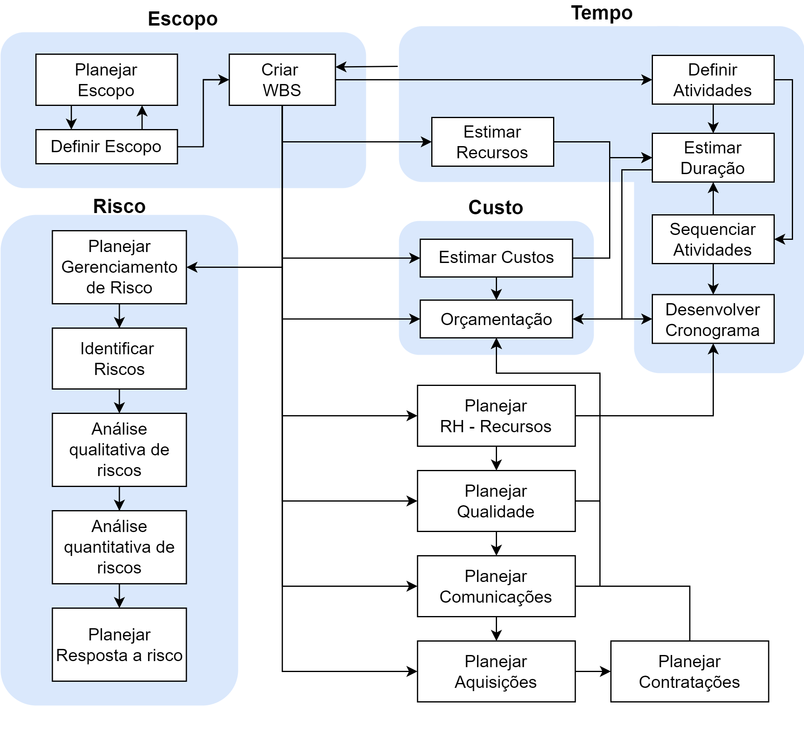

# Planejamento do Cronograma

## *Softwares*

- Microsoft Project
- Primavera P6
- ProjectLibre (OpenSource)
- Trello/JIRA
- ASANA
- Monday.com

## Modelos de Apresentação de Cronograma

- Lista de atividades
- Gráfico de Barras ([Gráfico de Gantt](Gantt.md))
- Rede de Cronograma

## Relação entre os processos do Projeto

# Plano de Gerenciamento do Cronograma

1. Definir atividades
2. Sequenciar atividades- Representar rede
3. Estimar duração e cronograma preliminares (Considera recurso disponível e/ou recurso padrão conhecido)
4. Estimar recursos
5. Estimar duração final
6. Desenvolver cronograma final
7. Nivelar recursos

## 1 - Definir Atividades

Uma maneira de realizar a definição das atividades é patir da [Estrutura Analitica de Projetos (WBS)](WBS.md). A ideia neste caso é detalhar cada entrega da WBS gráfica, que normalmente refere-se a um substantivo, em várias atividades (verbos) que serão necessários para alcançar o entregrável.

Nota: Apesar das atividades serem conceitualmente um detalhamento da WBS, não é viável documentá-las na WBS gráfica

| Entradas                        | Ferramentas                                              | Saídas             |
| ------------------------------- | -------------------------------------------------------- | ------------------- |
| Escopo definido                 | Decomposição                                           | Lista de Atividades |
| Fatores da empresa              | Planejamento ondas sucessivas (Pacotes de trabalho) | Lista de Marcos     |
| Estrutura Analítica do Projeto | Opinião Especializada                                   |                     |

## 2 - Sequenciar Atividades

Nesta etapa o intuito é definir a sequência de ocorrência de cada atividade listada, isto é essencial para garantir que todas as tarefas sejam realizadas de maneira ordenada e eficiente. Realiza-se a determinação da ordem lógica das atividades, estabelecendo dependências entre elas (quais atividades precisam ser concluídas antes que outras possam começar).

| Entradas                                                    | Ferramentas                            | Saídas                                   |
| ----------------------------------------------------------- | -------------------------------------- | ----------------------------------------- |
| Lista de Atividades                                         | Método diagrama de precedência (MDP) | Diagrama de rede do cronograma do proejto |
| Fatores da empresa Ativos de Processos Organizacionais | Determinação de precedência        |                                           |

## 3-Estimar Duração (Preliminar)

* **Esforço Total (Trabalho):** Quantidade de tempo  total que deverá ser consumida para se executar uma tarefa.
* **Duração:** Esforço total gasto para executar uma tarefa dividido pelas unidades de recursos.
* **Unidades de Recursos:** São as quantidades de recursos utilizadas

$$
\text{Duração} = \frac{\text{Esforço Total}}{\text{Recursos Alocados}}
$$

* **Duração Fixa:** a duração é um valor fixo e quaisquer alterações no esforço (trabalho) ou nas unidades atribuídas (recursos) não têm impacto sobre a duração das tarefas
* **Esforço Fixo:** o esforço total permanecerá fixo, de forma que alterações na duração ou nos recursos não têm impacto no esforço total.
* **Recursos Fixos**: a quantidade de recursos é fixa de forma que uma alteração nos demais parâmetros não afeta o número de recursos alocados.

| Duração Fixa                                                                                                                              | Esforço Fixo                                              | Recursos Fixos                                                                                             |
| ------------------------------------------------------------------------------------------------------------------------------------------- | ---------------------------------------------------------- | ---------------------------------------------------------------------------------------------------------- |
| Fixamos duração quando precisamos realizar atividades em um determinado  tempo, não importando quantas  pessoas trabalhem | Fixamos esforço quando o valor/custo é um limitante | Fixamos os recursos quando não temos como contratar outros especialista com aquele conhecimento |

## 4 - Planejamento de Recursos

Não será tratado neste documento sobre o Planejameto de Recursos. No entanto o conceito básico é de que a utilização de recursos humanos em um projeto deve ser a mais uniforme possível. Com isso, pode-se manter uma equipe de projeto única, do seu início ao final, permitindo:

* Diminuição de sobrecargas
* Menor tempo gasto em aprendizagem
* Facilidade de alocação de recursos interprojeto

## 5- Estimar Duração (Final)

### Ferramentas para estimar duração

1. Opinião Especializada orientada por informações históricas
2. Estimativa Análoga: Duração real de uma atividade anterior semelhante do cronograma como base para a estimativa da duração de uma futura atividade. A estimativa análoga usa as informações históricas e a opinião especializada.
3. Estimativa Paramétrica: Determinada quantitativamente multiplicando a quantidade de trabalho a
   ser realizado pelo valor da produtividade
4. Estimativas de três pontos: Construcão de três cenários mais provável, otimista e pessimista
5. Tomada de decisão em grupo:  Método Delphi
6. Análise de reserva: As equipes de projetos podem optar por incorporar tempo adicional como
   reconhecimento do risco do cronograma

### Estimativa de cada Atividade

| Entradas                                 | Ferramentas                                                                      | Saida                                   |
| ---------------------------------------- | -------------------------------------------------------------------------------- | --------------------------------------- |
| Lista de Atividades                      | Opinião Especializada                                                           | Estimativas de duração das atividades |
| Requisitos de recursos de atividade | Estimativa Paramétrica Estimativa Análoga Estimativa de três pontos |                                         |
| Calendário dos recursos                 | Técnica de tomada de decisão em grupo                                     |                                         |
| Fatores da empresa                       | Análise de reservas                                                             |                                         |
| Ativos de processos organizacionais      |                                                                                  |                                         |
| Registro dos riscos                      |                                                                                  |                                         |

### Estimativa do Projeto Inteiro

A maneira mais precisa de se estimar os esforços totais é obtendo-se uma relação entre o esforço e a complexidade, por meio de dados históricos. Uma das técnicas é a Análise de Regressão. Conhecendo o esforço e a quantidade de recursos disponíveis, podemos obter o valor da duração.

#### Análise de Rede: Caminho Crítico PERT/CPM

* **PERT (Program Evaluation and Review Technique):** desenvolvido em 1958, pela marinha americana, Booz-Alen e Lockheed Aircraft para a construção do submarino nuclear POLARIS (mais de 3000 empreiteiros). Envolveu o conceito de rede, mas não determinístico
* **CPM (Critical Path Method):** desenvolvido para a programação de operações com temposdeterminísticos (em uma aplicação na DuPont)

O **método PERT/CPM** trata-se de um método heurístico para análise da rede que permite identificar a duração mínima do projeto, os intervalos de tempo dentro do qual cada atividade deve ser iniciada, as folgas existentes para cada atividade e quais as atividades que são críticas e não podem ser atrasadas

Ao final obtém-se o denominado Caminho Crítico que é a cadeia de atividades que determina o gargalo do projeto, isso é, que determina o
menor prazo de execução. As etapas do método são:

1. Realizar a verificação para frente, calculando a Programação Cedo
2. Realizar a verificação para trás, calculando a  Programação Tarde
3. Calcular folgas e
4. Identificação do caminho crítico

**Atividade crítica:** É nome dado às atividades que possuem folga igual a zero (FT=0). Isso porque, caso alguma delas se atrase, haverá um atraso total no projeto, na mesma proporção.

**Caminho Crítico:** corresponde à sequência de atividades com folga total igual a 0

# 6- Desenvolver Cronograma Final

O gráfico de Gantt pode ser muito útil para visualizar e organizar as atividades do projeto e seus respectivos cronogramas. Ele fornece uma visão clara do progresso do projeto e ajuda a identificar possíveis atrasos ou desvios no cronograma. Além disso, o gráfico de Gantt ajuda a identificar quais atividades têm maior importância e prioridade para o projeto.

Com o gráfico de Gantt, é possível visualizar as atividades de forma horizontal, indicando seu início e término. Cada atividade é representada por uma barra colorida, que pode ser ajustada de acordo com a duração prevista. As atividades relacionadas são conectadas por linhas, permitindo identificar as dependências entre elas.

No caso específico do projeto de gerenciamento de riscos, o gráfico de Gantt pode ser usado para visualizar e acompanhar as atividades relacionadas à identificação, avaliação e mitigação dos riscos. Ele pode ajudar a identificar possíveis atrasos ou desvios no cronograma e ajustar o planejamento de acordo.

| Entradas                                     | Ferramentas                                  | Saídas                                    |
|----------------------------------------------|---------------------------------------------|-------------------------------------------|
| Plano de gerenciamento do cronograma         | Análise de Rede do cronograma                | Linha base do cronograma                  |
| Lista de atividades                          | Método do Caminho Crítico                   | Cronograma do projeto                     |
| Atributos das atividades                     | Método da Corrente Crítica                  | Dados do cronograma                       |
| Diagrama de rede do projeto                  | Técnicas de otimização de recursos          | Calendários do projeto                    |
| Requisitos de recursos das atividades        | Técnicas de desenvolvimento de modelos      | Atualizações no plano de gerenciamento do projeto |
| Calendário dos recursos                      | Antecipações e esperas                      | Atualizações nos documentos do projeto    |
| Estimativas das durações                     | Compressão do cronograma                    |                                           |
| Especificação do escopo                      | Ferramenta de cronograma                    |                                           |
| Registro dos riscos                          |                                             |                                           |
| Designações do pessoal                       |                                             |                                           |
| Estrutura analítica dos recursos             |                                             |                                           |
| Fatores ambientais                           |                                             |                                           |
| Ativos de processos organizacionais          |                                             |                                           |

