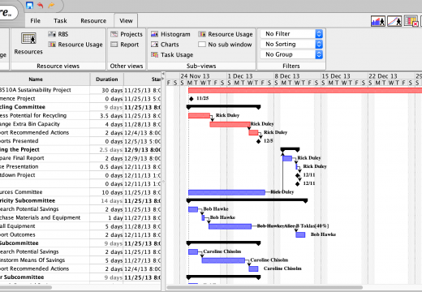

### Gráfico de Gantt

O Gráfico de Gantt é uma representação visual de um cronograma de projeto, onde as atividades são listadas no eixo vertical e o tempo no eixo horizontal.

1. **Objetivo**

   - Facilitar o planejamento, a coordenação e o acompanhamento das atividades do projeto.
   - Visualizar a duração das atividades, suas sequências e interdependências.
2. **Componentes Principais**

   - **Tarefas/Atividades:** Listadas no eixo vertical (y).
   - **Linha do Tempo:** Representada no eixo horizontal (x).
   - **Barras:** Cada barra representa a duração de uma tarefa, mostrando seu início e término.
   - **Dependências:** Linhas que conectam as tarefas, indicando a sequência e as relações entre elas.

```
Tarefas               | Janeiro | Fevereiro | Março | Abril | Maio |
-------------------------------------------------------------------
Planejamento          |■■■■■■■■■■■■■|
Fundação              |             ■■■■■■■■■■■■■■■■■■■■■■■■■■■■|
Estrutura             |                         ■■■■■■■■■■■■■■■■■■■■■■■|
Instalações           |                                    ■■■■■■■■■■■■■■■■■■■■■■■|
Acabamento            |                                                ■■■■■■■■■■■■■■■■■■■■■■■■■■■■|
```

## Vantagens e Desvantagens

1. **Vantagens**

   - **Visualização Clara:** Fornece uma visão imediata do progresso do projeto.
   - **Planejamento:** Ajuda a identificar o tempo necessário para cada atividade e planejar adequadamente.
   - **Controle:** Facilita o monitoramento do progresso e a identificação de atrasos.
   - **Comunicação:** Útil para comunicar o plano do projeto aos membros da equipe e partes interessadas.
2. **Limitações**

   - **Complexidade:** Pode se tornar difícil de gerenciar para projetos muito grandes ou complexos.
   - **Atualização:** Requer atualizações frequentes para refletir mudanças no cronograma.
   - **Detalhamento:** Pode não capturar todos os detalhes ou nuances das interdependências entre as tarefas.

## Uso na Gestão de Projetos

- **Planejamento Inicial:** Criar o cronograma inicial do projeto.
- **Acompanhamento:** Monitorar o progresso das atividades em relação ao cronograma planejado.
- **Revisão:** Ajustar o cronograma conforme necessário para refletir mudanças ou atrasos.

## Ferramentas Comuns para Criação de Gráficos de Gantt

- **Microsoft Project:** Ferramenta robusta de gerenciamento de projetos com funcionalidades avançadas de gráficos de Gantt.
- **Smartsheet:** Plataforma baseada em planilhas que inclui funcionalidades de gráficos de Gantt.
- **Asana e Trello:** Ferramentas de gerenciamento de projetos que oferecem visualizações de Gantt através de plugins ou extensões.
- **Monday.com e Wrike:** Plataformas de gestão de trabalho que incluem gráficos de Gantt integrados.

## **Exemplo de Gráfico de Gantt**


