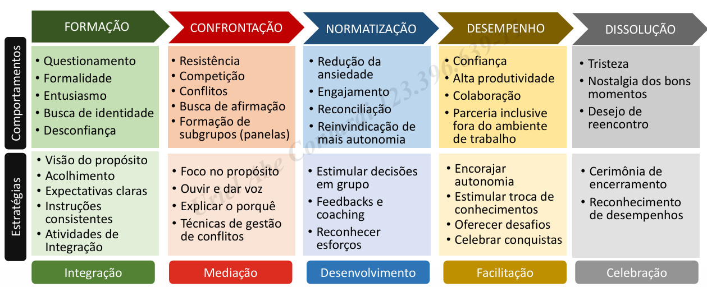

# Modelo de Tuckman

O Modelo de Tuckman, criado em 1965, pelo psicólogo Bruce Wayne Tuckman, é resultado de uma pesquisa, baseada na teoria da dinâmica de grupo, na qual ele identificou os 5 estágios de desenvolvimento de grupos. Esse modelo é como um mapa que serve como guia pelas diferentes fases que um time atravessa desde o momento em que se junta até quando atinge seu máximo desempenho.

1. **Formação (Forming)**: Nesta fase, o grupo se forma e os membros compartilham metas e tarefas. O entusiasmo é alto, mas as competências ainda são baixas. O papel do líder é crucial para estabelecer relações e normas.
2. **Confrontação (Storming)**: Os membros definem suas responsabilidades, mas surgem conflitos. As metas estão claras, mas os papéis ainda não. O trabalho real é limitado nesta fase.
3. **Normatização (Norming)**: O grupo começa a ganhar identidade. O entusiasmo e as competências aumentam. Aqui, os conflitos diminuem, pois os membros se conhecem melhor e respeitam suas habilidades. O líder desempenha um papel importante na definição dos processos de trabalho.
4. **Atuação (Performing)**: O grupo está funcionando bem. Os membros trabalham juntos de forma eficiente, com processos adequados aos papéis definidos anteriormente. O foco está na realização das metas compartilhadas.
5. **Dissolução (Adjourning)**: Esta etapa ocorre quando o grupo se desfaz, seja por conclusão do projeto ou outras razões. Os membros refletem sobre a experiência e se preparam para seguir caminhos separados.

